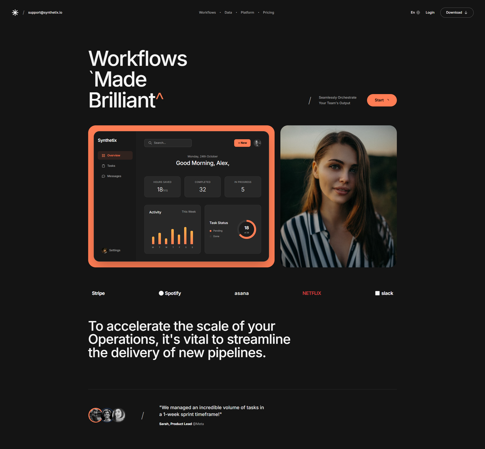
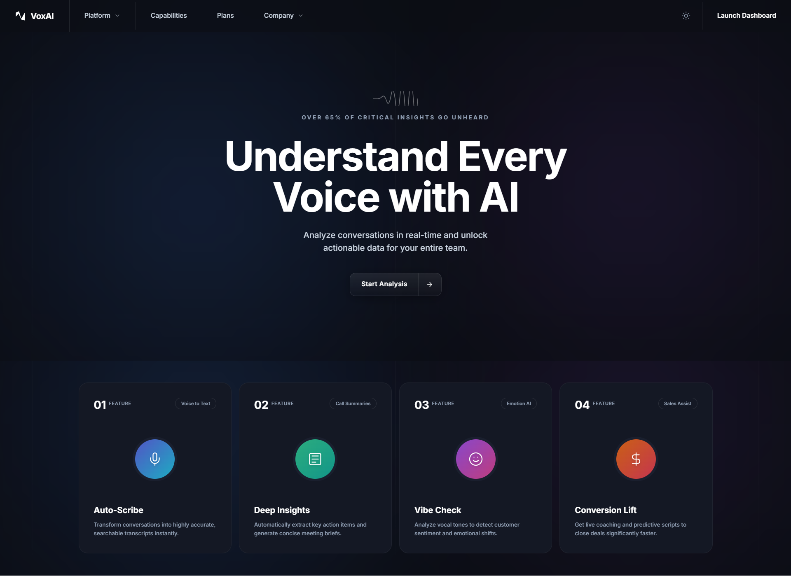
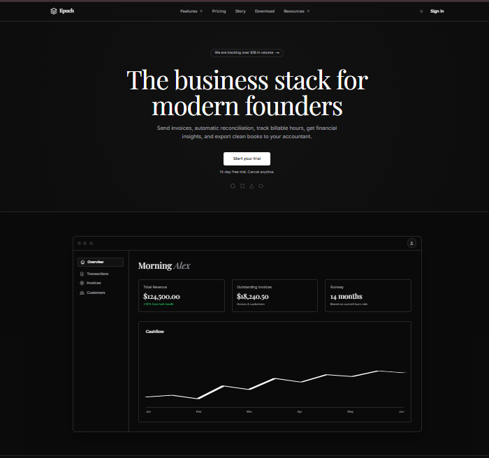

  <h1>🎨 Skillshelf Open-Source</h1>
  
<b>The ultimate DNA sequence for your AI coding agents.</b>

  
Standardized, LLM-optimized design systems that turn generic AI output into professional products.

  
  
  
  

---

   
  <a href="https://skillshelf-liart.vercel.app" style="text-decoration: none;">
    

      <h2 style="color: #C9FF45; margin: 0 0 12px 0; font-size: 24px; letter-spacing: -0.5px;">✨ Skillshelf Web Experience</h2>
      
Explore the complete registry with live interactive previews, real-time theme toggling, and instant code export functionality.

      

        🌐 https://skillshelf-liart.vercel.app
      

    

  </a>
     

---

## ⚡ Quick Start
1. **Source**: Pick a `SKILL.md` from the collection below and drop it in your project root.
2. **Execute**: Tell your AI (Cursor, Claude, or AI Agent): 
   > *"Reference SKILL.md for all UI decisions. Build a [component/page] following these exact rules."*
3. **Verify**: Check the output against the **Quality Gates** section in the skill file.

---

## 🗂️ The Collection
*Premium standardized design genomes. Click a category to expand.*

<b>💰 Finance & Wealth</b> — <i>Sophisticated, high-trust, and high-performance.</i>

 

|  |  |  |
| :---: | :---: | :---: |
| [**Aegis Glow**](skills/aegis-glow/) | [**PureWealth**](skills/purewealth/) | [**AuraWealth**](skills/aurawealth/) |
| *Obsidian Fintech* | *Warm Minimalist* | *Organic FinTech* |

<b>🛠️ Productivity & Workspace</b> — <i>Structured, data-dense, and workflow-optimized.</i>

 

|  |  |  |
| :---: | :---: | :---: |
| [**ForgeUI**](skills/forge-ui/) | [**FluxBoard**](skills/fluxboard/) | [**Quantify**](skills/quantify/) |
| *Developer IDE* | *Bento Kanban* | *Data Analytics* |

|  | | |
| :---: | :---: | :---: |
| [**Synthetix**](skills/synthetix/) | | |
| *Editorial Brutalism* | | |

<b>🚀 Future-Forward & AI</b> — <i>Atmospheric, experimental, and next-gen SaaS.</i>

 

|  |  |  |
| :---: | :---: | :---: |
| [**VoxAI**](skills/voxai/) | [**Epoch**](skills/epoch/) | [**Nova AI**](skills/nova-ai/) |
| *Ethereal SaaS* | *Editorial SaaS* | *Soft-Glass AI* |

|  |  | |
| :---: | :---: | :---: |
| [**Ecovolt**](skills/ecovolt/) | [**Big Shaped**](skills/big-shaped/) | |
| *Eco-Brutalist* | *Architectural* | |

   
  
<b>Ready for more?</b>

  <a href="https://github.com/Samyk000/skillshelf-os/issues/new?template=request-skill.yml">Request a Skill</a> • <a href="CONTRIBUTING.md">Contribute</a>

---

## 📦 Documentation DNA
Each `SKILL.md` is handcrafted for maximum AI comprehension across **8 critical dimensions**:
`Mission & Brand` • `Style Foundations` • `Component Families` • `Accessibility` • `Rules: Do / Don't` • `Interaction Behavior` • `Quality Gates` • `Agent Prompting`

---

---

---

## 🤝 Community
Help us build the absolute best design resource for the AI age. 
- **Submit a Skill**: Use our template to extract DNA from your favorite designs.
- **Fix / Refine**: Found a hex color that's slightly off? Missing a component state? Open a PR!

  Built with ❤️ for the AI era by <a href="https://github.com/Samyk000">Samyk000</a>
   
  Licensed under MIT © 2026 Skillshelf Contributors

