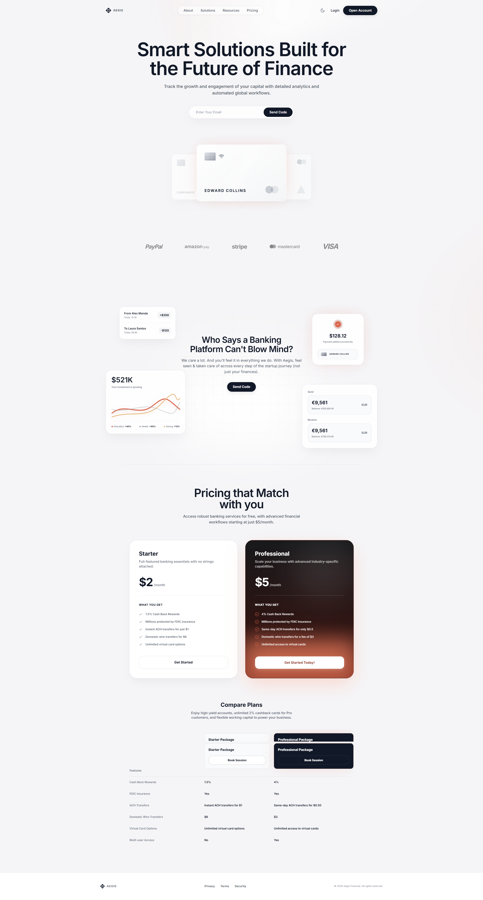
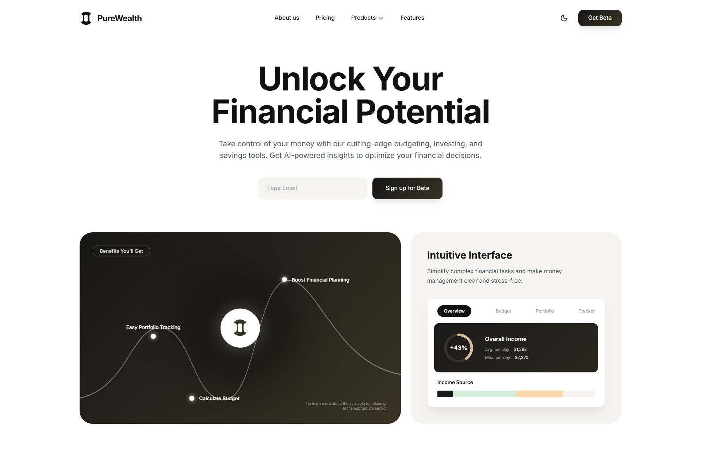
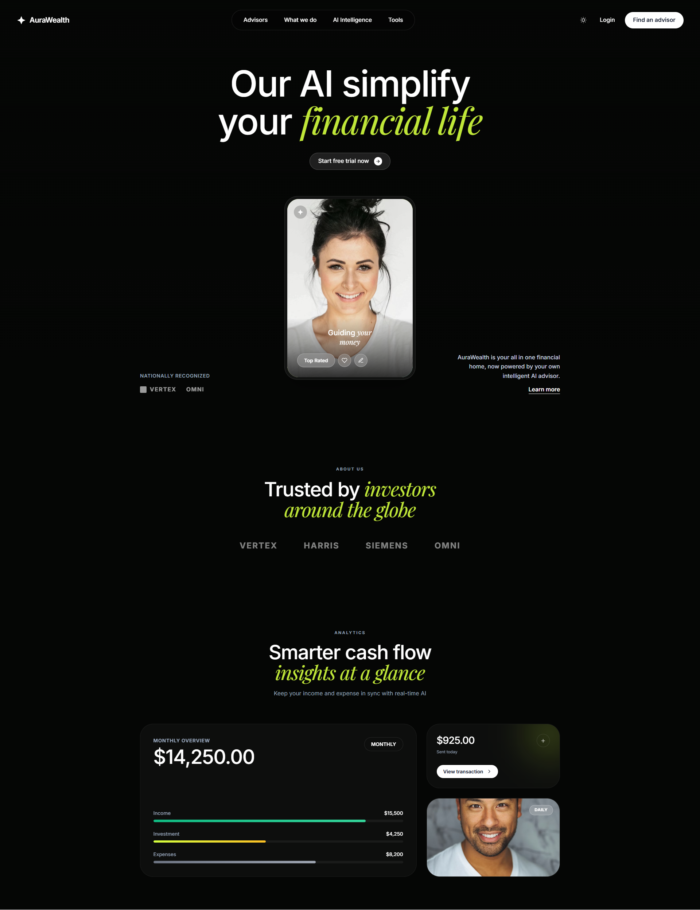
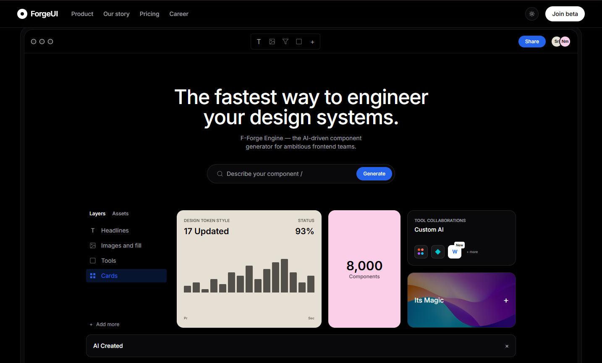
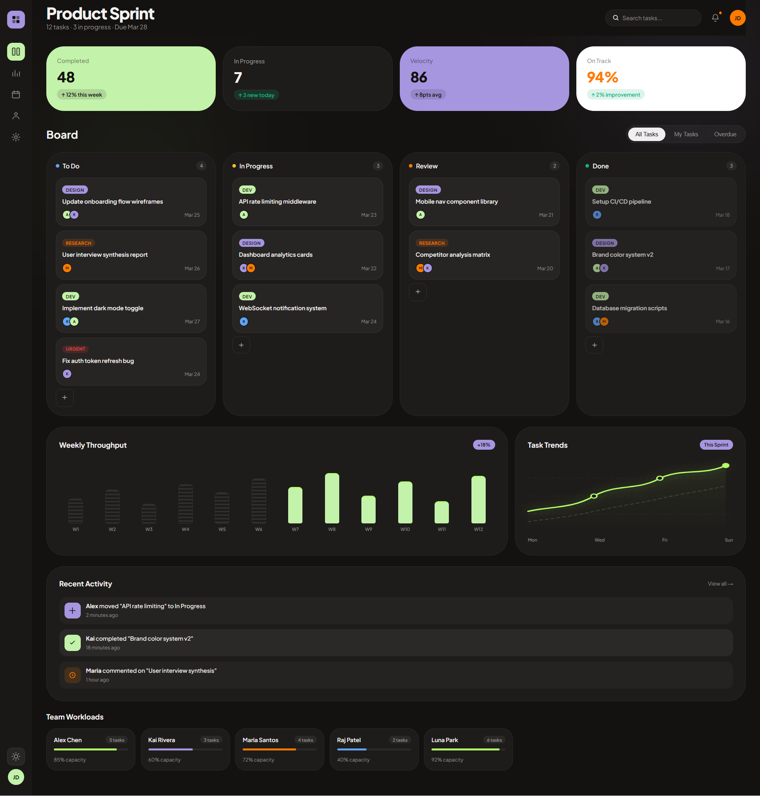
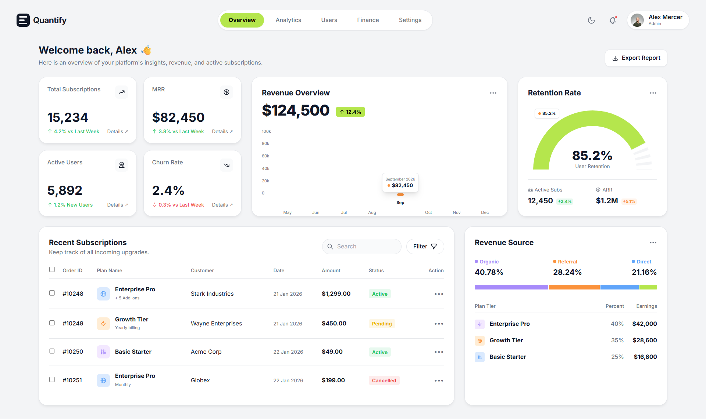
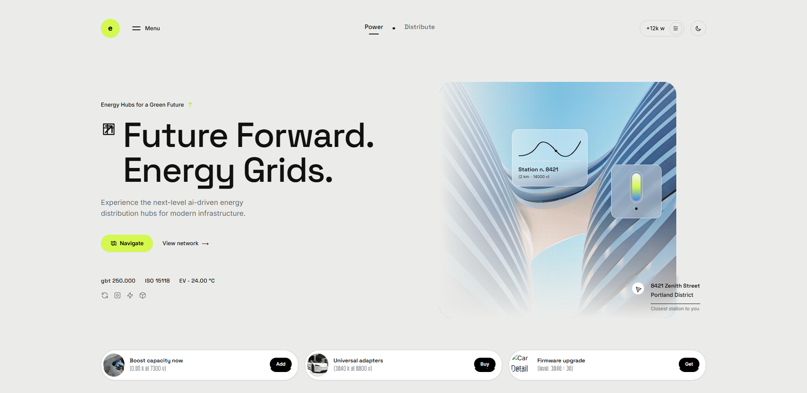
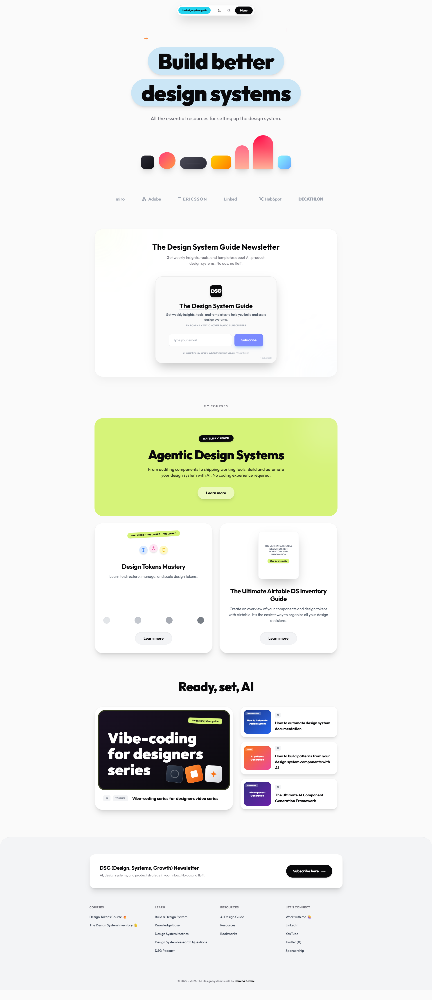

  
  <h1>🎨 Skillshelf Open Design</h1>
  
<b>The ultimate DNA sequence for your AI coding agents.</b>

  
Standardized, LLM-optimized design systems that turn generic AI output into professional products.

  
  
  
  

---

## ⚡ Quick Start
1. **Source**: Pick a `SKILL.md` from the gallery below and drop it in your project root.
2. **Execute**: Tell your AI (Cursor, Claude, or Copilot): 
   > *"Reference SKILL.md for all UI decisions. Build a [component/page] following these exact rules."*
3. **Verify**: Check the output against the **Quality Gates** section in the skill file.

---

## 💎 Why use SKILL.md?
Generic AI prompts lead to "default" looks. `SKILL.md` injects professional design tokens directly into the agent's context window.

*   **Pixel-Perfect Consistency**: Every button, input, and card follows the same logic.
*   **Behavioral Accuracy**: Defines hover states, transitions, and meaningful motion.
*   **Zero-Guessing**: Stops the AI from making up "standard" spacing or off-brand colors.

---

## 🗂️ The Collection
*Sorted by industry and design philosophy. Click any preview to explore the skill.*

### 💰 Finance & Wealth
*Sophisticated, trustworthy, and high-performance interfaces.*

| Preview | Identity & Style |
| :--- | :--- |
|  | **[Aegis Glow](skills/aegis-glow/)** Obsidian & Copper Fintech UI. Luxurious metallic interfaces with cinematic lighting and glassmorphic cards. |
|  | **[PureWealth](skills/purewealth/)** Warm Minimalist SaaS. Sophisticated palette of warm-white and soft beige with asymmetrical bento layouts. |
|  | **[AuraWealth](skills/aurawealth/)** Organic FinTech. Structured UI components floating above deep nature motifs with striking lime accents. |

### 🛠️ Productivity & Admin
*Structured, efficient, and data-dense layouts for professional tools.*

| Preview | Identity & Style |
| :--- | :--- |
|  | **[ForgeUI](skills/forge-ui/)** Developer-First Dark IDE. High-contrast aesthetic with pastel accents and modular bento grids. |
|  | **[FluxBoard](skills/fluxboard/)** Premium Kanban Design. Neo-Dark style with vibrant accent blocks and ambient productivity glows. |
|  | **[Quantify](skills/quantify/)** Data-Dense Analytics. Information-rich interfaces with vibrant lime accents and flexible card layouts. |

### 🚀 Future-Forward SaaS
*Modern, vibrant, and experimental designs for next-generation applications.*

| Preview | Identity & Style |
| :--- | :--- |
|  | **[Nova AI](skills/nova-ai/)** Radiant Soft-Glass AI. Airy SaaS interfaces with sunburst gradients and floating 3D glassmorphic cards. |
|  | **[Ecovolt](skills/ecovolt/)** Eco-Brutalist Clean Tech. Stark typography meets organic softness with neon lime pill-shaped containers. |
|  | **[Big Shaped](skills/big-shaped/)** Architectural Typography. Sharp structure meets organic softness with neon lime accents and glassmorphic overlays. |

   
  
<b>Ready for more?</b>

  <a href="https://github.com/Samyk000/skillshelf-os/issues/new?template=request-skill.yml">Request a Skill</a> • <a href="CONTRIBUTING.md">Contribute</a>

---

## 📦 Documentation DNA
Each `SKILL.md` is handcrafted for maximum AI comprehension across 8 critical dimensions:

1. **Mission & Brand**: The core "why" and "feel" of the design.
2. **Style Foundations**: Exact tokens for colors, type, and spacing.
3. **Component Families**: Ready-to-build patterns for buttons, cards, etc.
4. **Accessibility**: WCAG compliance and inclusive design rules.
5. **Rules: Do / Don't**: Strict guardrails to prevent design drift.
6. **Interaction Behavior**: How the UI moves, breathes, and reacts.
7. **Quality Gates**: A checklist for the AI (and you) to verify output.
8. **Agent Prompting**: Specific triggers to get the best results.

---

## 🤝 Community
Help us build the absolute best design resource for the AI age. 
- **Submit a Skill**: Use our template to extract DNA from your favorite designs.
- **Fix / Refine**: Found a hex color that's slightly off? Missing a component state? Open a PR!

---

  Built with ❤️ for the AI era by <a href="https://github.com/Samyk000">Samyk000</a>
   
  Licensed under MIT © 2026 Skillshelf Contributors

